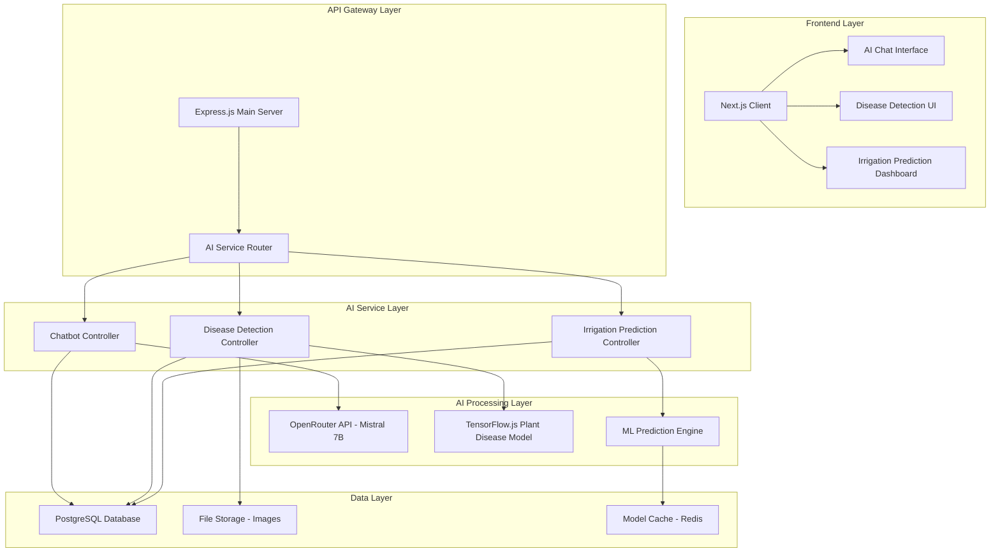

# Design Document - Tích hợp Tính năng AI

## Overview

Thiết kế hệ thống AI tích hợp cho dự án Plant Monitoring System, bao gồm ba tính năng chính: Chatbot AI chuyên về cây trồng, Dự báo tưới cây thông minh, và Nhận diện bệnh cây qua ảnh. Hệ thống được thiết kế để tích hợp mượt mà với kiến trúc hiện tại (Node.js/Express backend, Next.js frontend, PostgreSQL database).

## Architecture

### High-Level Architecture



### Service Integration Pattern

Hệ thống AI sẽ được tích hợp như một microservice độc lập nhưng kết nối chặt chẽ với hệ thống chính:

- **AI Service Port**: 3001 (đã có sẵn)
- **Main Server Port**: 3010 
- **Frontend Port**: 3000
- **Communication**: REST API + WebSocket cho real-time

## Components and Interfaces

### 1. Chatbot AI Component

#### Architecture
- **Model**: Mistral 7B Instruct qua OpenRouter API
- **Context Management**: Lưu trữ lịch sử chat và thông tin cây trồng
- **Scope Limitation**: Chỉ trả lời về cây trồng, từ chối các chủ đề khác

#### API Endpoints
```javascript
// Chatbot endpoints
POST /api/ai/chatbot/message
GET /api/ai/chatbot/history/:sessionId
GET /api/ai/chatbot/sessions/:userId
DELETE /api/ai/chatbot/session/:sessionId
```

#### Data Models
```sql
-- Mở rộng bảng ChatHistory hiện có
ALTER TABLE chat_histories ADD COLUMN IF NOT EXISTS session_id VARCHAR(255);
ALTER TABLE chat_histories ADD COLUMN IF NOT EXISTS plant_context JSONB;
ALTER TABLE chat_histories ADD COLUMN IF NOT EXISTS ai_confidence FLOAT;
ALTER TABLE chat_histories ADD COLUMN IF NOT EXISTS topic_category VARCHAR(100);
```

#### Context Integration
- Tích hợp dữ liệu cảm biến real-time
- Lịch sử tưới nước của cây
- Thông tin loại cây và đặc điểm
- Phân tích tình trạng sức khỏe cây

### 2. Irrigation Prediction Component

#### ML Model Architecture
```javascript
// Prediction model structure
const IrrigationModel = {
  inputs: [
    'soilMoisture',      // Độ ẩm đất (%)
    'temperature',       // Nhiệt độ (°C)
    'humidity',          // Độ ẩm không khí (%)
    'lightLevel',        // Cường độ ánh sáng (lux)
    'plantType',         // Loại cây (encoded)
    'seasonalFactor',    // Yếu tố mùa vụ
    'lastWateringHours', // Giờ từ lần tưới cuối
    'weatherForecast'    // Dự báo thời tiết
  ],
  outputs: [
    'shouldWater',       // Có nên tưới (boolean)
    'hoursUntilWater',   // Số giờ đến lần tưới tiếp theo
    'waterAmount',       // Lượng nước cần tưới (ml)
    'confidence'         // Độ tin cậy dự báo (0-1)
  ]
}
```

#### API Endpoints
```javascript
// Irrigation prediction endpoints
POST /api/ai/irrigation/predict/:plantId
POST /api/ai/irrigation/schedule/:plantId
GET /api/ai/irrigation/recommendations/:plantId
POST /api/ai/irrigation/feedback
```

#### Algorithm Design
1. **Data Collection**: Thu thập dữ liệu cảm biến 24h gần nhất
2. **Feature Engineering**: Tính toán các đặc trưng từ dữ liệu thô
3. **Model Inference**: Sử dụng TensorFlow.js để dự báo
4. **Post-processing**: Áp dụng business rules và safety checks
5. **Recommendation Generation**: Tạo khuyến nghị cụ thể

### 3. Disease Detection Component

#### Model Architecture
- **Base Model**: MobileNetV2 pre-trained
- **Custom Layers**: Fine-tuned cho bệnh cây phổ biến ở Việt Nam
- **Input**: Ảnh RGB 224x224 pixels
- **Output**: Phân loại bệnh + confidence score

#### Supported Diseases
```javascript
const SUPPORTED_DISEASES = {
  'healthy': 'Cây khỏe mạnh',
  'leaf_spot': 'Đốm lá',
  'powdery_mildew': 'Phấn trắng',
  'rust': 'Bệnh gỉ sắt',
  'bacterial_blight': 'Cháy lá do vi khuẩn',
  'viral_mosaic': 'Bệnh khảm virus',
  'nutrient_deficiency': 'Thiếu dinh dưỡng',
  'pest_damage': 'Sâu hại'
};
```

#### API Endpoints
```javascript
// Disease detection endpoints
POST /api/ai/disease/analyze
GET /api/ai/disease/history/:plantId
POST /api/ai/disease/feedback/:analysisId
GET /api/ai/disease/treatments/:diseaseType
```

#### Image Processing Pipeline
1. **Upload & Validation**: Kiểm tra định dạng, kích thước ảnh
2. **Preprocessing**: Resize, normalize, augmentation
3. **Model Inference**: Phân tích qua TensorFlow.js model
4. **Post-processing**: Lọc kết quả, tính confidence
5. **Treatment Recommendation**: Đề xuất phương pháp điều trị

## Data Models

### Enhanced Database Schema

```sql
-- Bảng lưu trữ kết quả phân tích AI
CREATE TABLE ai_analyses (
    id SERIAL PRIMARY KEY,
    plant_id INTEGER REFERENCES plants(id),
    user_id INTEGER REFERENCES users(id),
    analysis_type VARCHAR(50) NOT NULL, -- 'disease_detection', 'irrigation_prediction'
    input_data JSONB NOT NULL,
    result_data JSONB NOT NULL,
    confidence_score FLOAT,
    created_at TIMESTAMP DEFAULT CURRENT_TIMESTAMP,
    updated_at TIMESTAMP DEFAULT CURRENT_TIMESTAMP
);

-- Bảng lưu trữ feedback từ người dùng
CREATE TABLE ai_feedback (
    id SERIAL PRIMARY KEY,
    analysis_id INTEGER REFERENCES ai_analyses(id),
    user_id INTEGER REFERENCES users(id),
    feedback_type VARCHAR(50), -- 'correct', 'incorrect', 'partially_correct'
    user_comment TEXT,
    actual_result JSONB,
    created_at TIMESTAMP DEFAULT CURRENT_TIMESTAMP
);

-- Bảng lưu trữ ảnh bệnh cây
CREATE TABLE plant_disease_images (
    id SERIAL PRIMARY KEY,
    plant_id INTEGER REFERENCES plants(id),
    user_id INTEGER REFERENCES users(id),
    image_path VARCHAR(500) NOT NULL,
    analysis_id INTEGER REFERENCES ai_analyses(id),
    upload_timestamp TIMESTAMP DEFAULT CURRENT_TIMESTAMP
);

-- Bảng lưu trữ model AI metadata
CREATE TABLE ai_models (
    id SERIAL PRIMARY KEY,
    model_name VARCHAR(100) NOT NULL,
    model_type VARCHAR(50) NOT NULL, -- 'disease_detection', 'irrigation_prediction'
    version VARCHAR(20) NOT NULL,
    accuracy_score FLOAT,
    model_path VARCHAR(500),
    is_active BOOLEAN DEFAULT false,
    created_at TIMESTAMP DEFAULT CURRENT_TIMESTAMP
);

-- Indexes for performance
CREATE INDEX idx_ai_analyses_plant_id ON ai_analyses(plant_id);
CREATE INDEX idx_ai_analyses_type ON ai_analyses(analysis_type);
CREATE INDEX idx_ai_feedback_analysis_id ON ai_feedback(analysis_id);
CREATE INDEX idx_plant_disease_images_plant_id ON plant_disease_images(plant_id);
```

### Data Flow Models

```javascript
// Chatbot conversation flow
const ChatbotFlow = {
  input: {
    message: "string",
    userId: "number",
    plantId: "number",
    sessionId: "string"
  },
  processing: {
    contextRetrieval: "sensor_data + plant_info + chat_history",
    aiInference: "openrouter_api_call",
    responseGeneration: "formatted_response"
  },
  output: {
    response: "string",
    confidence: "number",
    suggestedActions: "array",
    relatedTopics: "array"
  }
}

// Disease detection flow
const DiseaseDetectionFlow = {
  input: {
    imageFile: "multipart/form-data",
    plantId: "number",
    userId: "number"
  },
  processing: {
    imagePreprocessing: "resize + normalize",
    modelInference: "tensorflow_js_prediction",
    resultProcessing: "confidence_filtering + treatment_lookup"
  },
  output: {
    diseases: "array",
    confidence: "number",
    treatments: "array",
    preventionTips: "array"
  }
}
```

## Error Handling

### Error Categories and Responses

```javascript
const ErrorHandling = {
  // AI Service Errors
  AI_SERVICE_UNAVAILABLE: {
    code: 'AI_001',
    message: 'Dịch vụ AI tạm thời không khả dụng',
    fallback: 'Sử dụng phản hồi được lập trình sẵn',
    retryStrategy: 'Exponential backoff với 3 lần thử'
  },
  
  // Model Errors
  MODEL_INFERENCE_FAILED: {
    code: 'AI_002', 
    message: 'Không thể phân tích dữ liệu',
    fallback: 'Trả về kết quả dựa trên rules-based system',
    logging: 'Ghi log chi tiết để debug'
  },
  
  // Data Errors
  INSUFFICIENT_DATA: {
    code: 'AI_003',
    message: 'Không đủ dữ liệu để phân tích chính xác',
    fallback: 'Yêu cầu người dùng cung cấp thêm thông tin',
    guidance: 'Hướng dẫn cách thu thập dữ liệu tốt hơn'
  },
  
  // Image Processing Errors
  IMAGE_PROCESSING_FAILED: {
    code: 'AI_004',
    message: 'Không thể xử lý ảnh',
    fallback: 'Yêu cầu ảnh chất lượng tốt hơn',
    validation: 'Kiểm tra format, size, độ phân giải'
  }
};
```

### Graceful Degradation Strategy

1. **Primary AI Service**: OpenRouter API với Mistral 7B
2. **Secondary Fallback**: Rule-based responses cho chatbot
3. **Tertiary Fallback**: Static knowledge base responses
4. **Emergency Mode**: Cơ bản chỉ trả lời "Liên hệ chuyên gia"

## Testing Strategy

### Unit Testing
```javascript
// Chatbot testing
describe('Chatbot Controller', () => {
  test('should respond to plant care questions', async () => {
    const response = await chatbot.handleMessage({
      message: 'Cây của tôi có lá vàng',
      plantId: 1,
      userId: 1
    });
    expect(response.success).toBe(true);
    expect(response.response).toContain('lá vàng');
  });
  
  test('should reject non-plant questions', async () => {
    const response = await chatbot.handleMessage({
      message: 'Thời tiết hôm nay thế nào?',
      plantId: 1,
      userId: 1
    });
    expect(response.response).toContain('chỉ tư vấn về cây trồng');
  });
});

// Disease detection testing
describe('Disease Detection', () => {
  test('should detect common plant diseases', async () => {
    const mockImage = createMockPlantImage('leaf_spot');
    const result = await diseaseDetection.analyze(mockImage);
    expect(result.diseases[0].name).toBe('leaf_spot');
    expect(result.confidence).toBeGreaterThan(0.7);
  });
});
```

### Integration Testing
- Test API endpoints với real data
- Test database operations
- Test file upload và image processing
- Test AI model inference pipeline

### Performance Testing
- Load testing với 100 concurrent users
- Response time < 3 seconds cho chatbot
- Image processing < 10 seconds
- Memory usage monitoring

### User Acceptance Testing
- Test với real plant images
- Test chatbot conversations
- Test irrigation recommendations accuracy
- Feedback collection và analysis

## Security Considerations

### Data Protection
```javascript
const SecurityMeasures = {
  imageUpload: {
    validation: 'File type, size, malware scanning',
    storage: 'Encrypted storage với access control',
    retention: 'Auto-delete sau 30 ngày nếu không cần'
  },
  
  chatHistory: {
    encryption: 'End-to-end encryption cho sensitive data',
    anonymization: 'Remove PII trước khi lưu trữ',
    retention: 'Configurable retention policy'
  },
  
  aiApiKeys: {
    storage: 'Environment variables + secret management',
    rotation: 'Regular key rotation',
    monitoring: 'Usage tracking và anomaly detection'
  }
};
```

### API Security
- Rate limiting: 100 requests/minute per user
- Input validation và sanitization
- CORS configuration cho frontend domains
- JWT authentication cho protected endpoints

## Performance Optimization

### Caching Strategy
```javascript
const CachingLayers = {
  // Model predictions cache
  modelCache: {
    type: 'Redis',
    ttl: '1 hour',
    keys: 'plant_id + sensor_data_hash'
  },
  
  // Chatbot responses cache
  responseCache: {
    type: 'In-memory LRU',
    size: '1000 entries',
    ttl: '30 minutes'
  },
  
  // Disease detection results
  diseaseCache: {
    type: 'Database + Redis',
    ttl: '24 hours',
    invalidation: 'On new analysis'
  }
};
```

### Model Optimization
- TensorFlow.js model quantization
- Lazy loading của AI models
- Batch processing cho multiple predictions
- WebWorker cho heavy computations

## Deployment Architecture

### Development Environment
```yaml
services:
  main-server:
    port: 3010
    env: development
    
  ai-service:
    port: 3001
    env: development
    volumes:
      - ./ai-service:/app
      - ./uploads:/app/uploads
      
  frontend:
    port: 3000
    env: development
    
  postgresql:
    port: 5432
    volumes:
      - postgres_data:/var/lib/postgresql/data
      
  redis:
    port: 6379
    volumes:
      - redis_data:/data
```

### Production Considerations
- Container orchestration với Docker Compose
- Load balancing cho AI service
- Database connection pooling
- CDN cho static assets và model files
- Monitoring và logging với Winston + ELK stack

## Migration Plan

### Phase 1: Core Infrastructure (Week 1-2)
1. Setup enhanced database schema
2. Implement basic AI service endpoints
3. Create frontend components structure
4. Setup testing framework

### Phase 2: Chatbot Implementation (Week 3-4)
1. Implement OpenRouter integration
2. Create context management system
3. Build chat UI components
4. Add conversation history

### Phase 3: Disease Detection (Week 5-6)
1. Implement TensorFlow.js model
2. Create image upload system
3. Build disease analysis UI
4. Add treatment recommendations

### Phase 4: Irrigation Prediction (Week 7-8)
1. Develop ML prediction model
2. Implement prediction algorithms
3. Create prediction dashboard
4. Add scheduling integration

### Phase 5: Integration & Testing (Week 9-10)
1. End-to-end testing
2. Performance optimization
3. Security audit
4. User acceptance testing

## Monitoring and Analytics

### Key Metrics
```javascript
const Metrics = {
  chatbot: {
    'response_time': 'Average response time',
    'user_satisfaction': 'Thumbs up/down ratio',
    'topic_coverage': 'Percentage of plant-related questions',
    'fallback_rate': 'Rate of fallback responses'
  },
  
  diseaseDetection: {
    'accuracy_rate': 'User-confirmed accuracy',
    'processing_time': 'Image analysis time',
    'confidence_distribution': 'Distribution of confidence scores',
    'disease_frequency': 'Most common detected diseases'
  },
  
  irrigationPrediction: {
    'prediction_accuracy': 'Actual vs predicted watering needs',
    'water_savings': 'Estimated water conservation',
    'user_adoption': 'Users following AI recommendations',
    'model_drift': 'Model performance over time'
  }
};
```

### Logging Strategy
- Structured logging với Winston
- Separate log levels cho development/production
- AI inference logging cho model improvement
- User interaction logging cho UX optimization